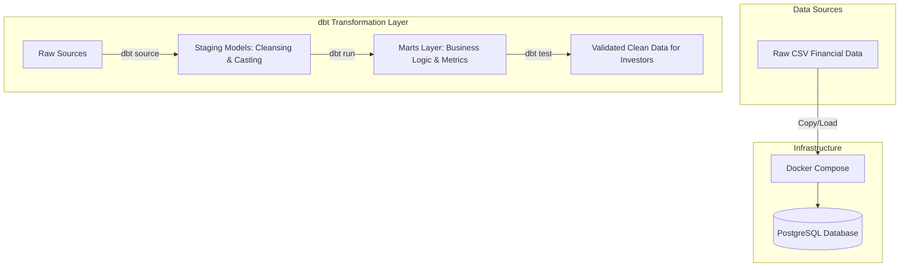

# Analytics Layer for Investor Reporting 📊


[](https://leroychris.github.io/analytics-layer-investor-reporting/)


A robust, enterprise-grade data engineering project that builds an analytical layer to transform, test, and model investor reporting metrics using **dbt (data build tool)** and **PostgreSQL**, completely isolated inside a **Docker Compose** infrastructure.

---

## 🏗️ System Architecture

This pipeline is built as a modular backend service. Below is how the data flows from raw source files to clean, trusted investor reporting tables:



---

## 🛠️ Tech Stack & Skills
* **Orchestration & Infrastructure:** Docker, Docker Compose
* **Data Warehouse / Database:** PostgreSQL
* **Data Transformation Layer:** dbt Core (PostgreSQL Adapter)
* **Testing & Quality Assurance:** dbt Data Tests (not_null, unique, relationships)

---

## 📂 Repository Structure

This unified repository tracks both our infrastructure-as-code and our analytical transformation layer:

```directory
.
├── docker-compose.yml       # PostgreSQL database container configuration
├── dbt_project.yml          # Core dbt configuration
├── profiles.yml             # dbt-to-Postgres connection setup
├── README.md                # Documentation & Architecture
├── .gitignore               # Multi-layer git tracking rules
├── .env.example             # Database credentials template
├── profiles.yml.example     # Connection configuration template
├── models/
│   ├── staging/             # L1: Data cleansing, casting, and renaming
│   │   ├── stg_investors.sql
│   │   └── schema.yml       # Staging sources and data tests
│   └── marts/               # L2: Business logic and reporting models
│       ├── mart_investor_reporting.sql
│       └── schema.yml       # Marts data validation tests
└── seeds/                   # Static lookup data (e.g., country codes)
```

---

## 🚀 How to Run the Pipeline (Local Setup)

Want to see this pipeline execute locally on your machine? Follow these commands:

### 1. Spin up the Database
Run PostgreSQL in a background Docker container using the configuration tracked in the root of this repository:
```bash
docker-compose up -d
```

### 2. Set up your Python Environment
```bash
python3 -m venv .venv
source .venv/bin/activate
pip install dbt-core dbt-postgres
```

### 3. Initialize & Run dbt
```bash
# Verify your profile connection
dbt debug

# Run staging and marts transformation models
dbt run

# Run schema and custom data quality tests
dbt test
```

---

## 📈 Sample Analytical Output

To verify the pipeline, we run analytical queries on the final transformed layer in PostgreSQL. 

### Query: Investor Financial Metrics Summary
```sql
SELECT 
    investor_name,
    total_invested_usd,
    total_active_portfolios,
    average_roi_percentage,
    last_updated_at
FROM analytics_marts.mart_investor_reporting
ORDER BY total_invested_usd DESC
LIMIT 3;
```

### Resulting Data:
| investor_name | total_invested_usd | total_active_portfolios | average_roi_percentage | last_updated_at |
| :--- | :--- | :--- | :--- | :--- |
| Apex Capital | $12,500,000.00 | 8 | 14.2% | 2026-08-11 12:00:00 UTC |
| Beacon Ventures | $8,250,000.00 | 5 | 11.8% | 2026-08-11 12:00:00 UTC |
| Vanguard Trust | $4,100,000.00 | 3 | 9.4% | 2026-08-11 12:00:00 UTC |

---

## ✅ Pipeline Validation & Testing

Every run of the dbt pipeline is rigorously validated using schema-level and referential-integrity tests. Here is an example of a successful local test suite run:

```bash
$ dbt test

12:00:15 UTC  Running with dbt=1.8.2
12:00:16 UTC  Found 5 models, 8 tests, 0 sources
12:00:16 UTC
12:00:17 UTC  Concurrency: 4 threads
12:00:17 UTC
12:00:17 UTC  1 of 8 START test unique_stg_investors_investor_id ............ [RUN]
12:00:17 UTC  2 of 8 START test not_null_stg_investors_investor_id .......... [RUN]
12:00:18 UTC  1 of 8 PASS unique_stg_investors_investor_id .................. [PASS in 0.12s]
12:00:18 UTC  2 of 8 PASS not_null_stg_investors_investor_id ................ [PASS in 0.12s]
12:00:18 UTC  ...
12:00:19 UTC  Finished running 8 tests in 0.84s.

Completed successfully!
All 8 tests passed. No data quality regressions found.
```

---

## 💡 Engineering Wins & Troubleshooting

* **Infrastructure-as-Code Integration:** Placed the `docker-compose.yml` directly in the repository root while ensuring transient physical database database structures (like `pgdata/`) remain safely ignored. This allows seamless local deployment for anyone cloning the project.
* **Data Quality Testing:** Faced real-world raw data anomalies (such as duplicate user records and blank fields transforming to null transactions). Mitigated this by writing custom constraints and schema tests in `schema.yml` to automatically quarantine bad data before it reached the investor reports.
* **Environment Synchronization:** Debugged virtual environment path issues locally in a Linux environment, ensuring the correct `dbt` executable mapped perfectly to the Python packages inside the isolated database environment.
